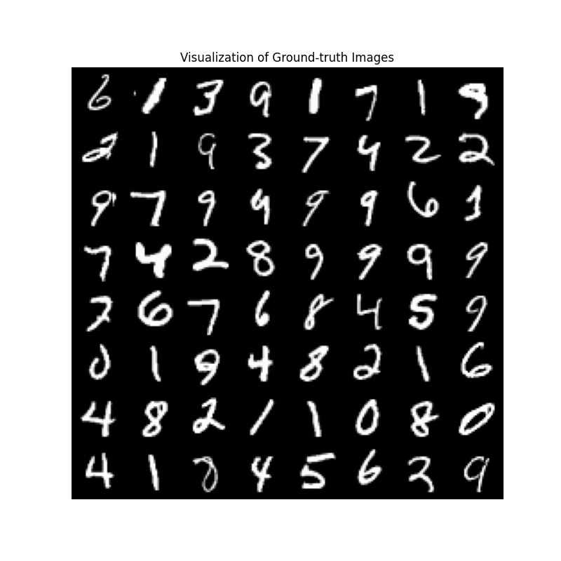
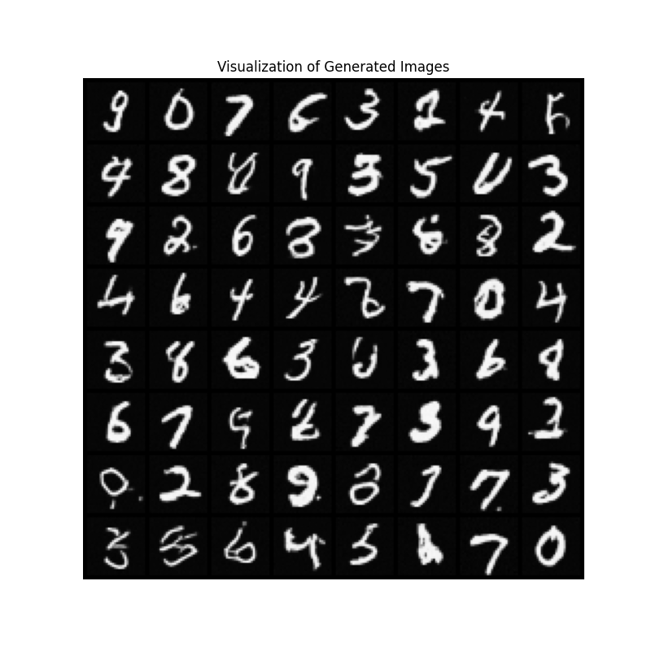

# Pytorch Conditional-Flow-Matching(CFM) Tutorial
A simple tutorial of [Conditional Flow Matching Models](https://arxiv.org/abs/2210.02747) (CFMs, Y. Lipman et. al., 2022) using MNIST dataset.

# Prerequisites
(1) Download Pytorch and etcs.
* [Anaconda](https://www.anaconda.com/)
* Python=3.11
* [Pytorch](https://pytorch.org/)=2.5. with CUDA 12.4

(2) Install dependencies via following command
```
sh install.sh
```

# Expremental Results
* Used a RTX-3090 GPU for all implementations.
* trained on MNIST dataset for 200 epochs

* ground-truth samples <br>



* generated samples <br>




# References

[1] [Neural Ordinary Differential Equations](https://arxiv.org/abs/1806.07366), R. T. Q. Chen et. al., 2018

[2] [Denoising Diffusion Probabilistic Models](https://arxiv.org/abs/2006.11239), J. Ho et. al., 2020

[3] [Flow Matching for Generative Modeling](https://arxiv.org/abs/2210.02747), Y. Lipman et. al., 2022


